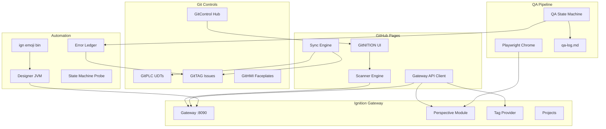

# GitNITION Architecture

```mermaid
graph TB
    subgraph "GitHub Pages"
        UI[GitNITION UI]
        SCAN[Scanner Engine]
        GWAPI[Gateway API Client]
        SYNC[Sync Engine]
    end

    subgraph "Ignition Gateway"
        GW[Gateway :8090]
        PERSP[Perspective Module]
        TAGS[Tag Provider]
        PROJ[Projects]
    end

    subgraph "Git Controls"
        PLC[GitPLC UDTs]
        TAG[GitTAG Issues]
        HMI[GitHMI Faceplates]
        CTRL[GitControl Hub]
    end

    subgraph "Automation"
        IGN[ign emoji bin]
        DESIGNER[Designer JVM]
        PROBE[State Machine Probe]
        ERLOG[Error Ledger]
    end

    subgraph "QA Pipeline"
        PW[Playwright Chrome]
        QA[QA State Machine]
        LOG[qa-log.md]
    end

    UI --> SCAN
    SCAN --> GW
    GWAPI --> GW
    GWAPI --> PERSP
    GWAPI --> TAGS
    SYNC --> TAG
    SYNC --> PLC
    IGN --> DESIGNER
    DESIGNER --> GW
    PW --> PERSP
    QA --> LOG
    QA --> ERLOG
    ERLOG --> TAG
    CTRL --> UI
```
