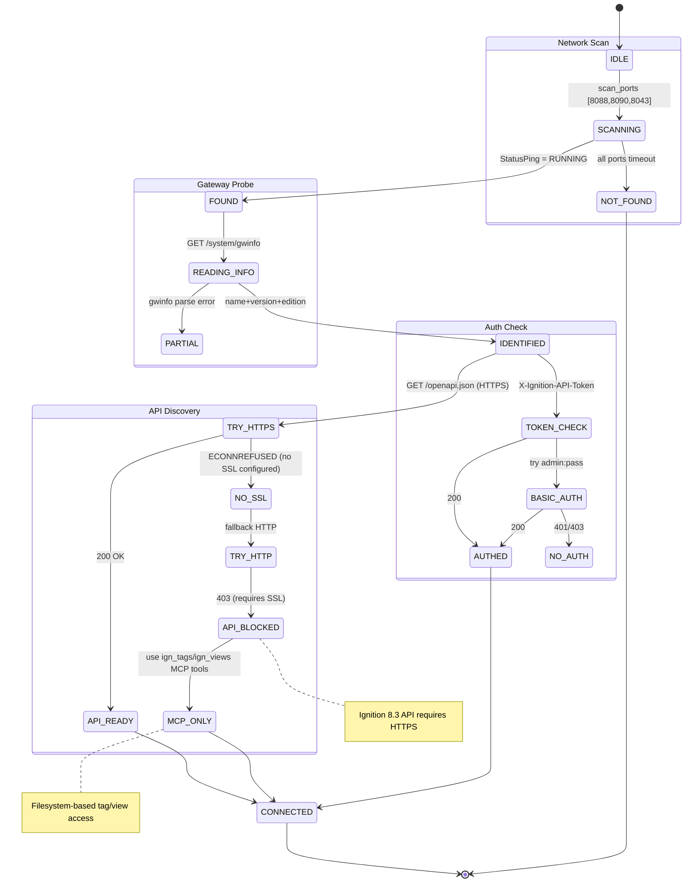

# Gateway Connection State Machine

```mermaid
stateDiagram-v2
    [*] --> IDLE

    state "Network Scan" as scan {
        IDLE --> SCANNING : scan_ports [8088,8090,8043]
        SCANNING --> FOUND : StatusPing = RUNNING
        SCANNING --> NOT_FOUND : all ports timeout
    }

    state "Gateway Probe" as probe {
        FOUND --> READING_INFO : GET /system/gwinfo
        READING_INFO --> IDENTIFIED : name+version+edition
        READING_INFO --> PARTIAL : gwinfo parse error
    }

    state "API Discovery" as api {
        IDENTIFIED --> TRY_HTTPS : GET /openapi.json (HTTPS)
        TRY_HTTPS --> API_READY : 200 OK
        TRY_HTTPS --> NO_SSL : ECONNREFUSED (no SSL configured)
        NO_SSL --> TRY_HTTP : fallback HTTP
        TRY_HTTP --> API_BLOCKED : 403 (requires SSL)
        API_BLOCKED --> MCP_ONLY : use ign_tags/ign_views MCP tools
    }

    state "Auth Check" as auth {
        IDENTIFIED --> TOKEN_CHECK : X-Ignition-API-Token
        TOKEN_CHECK --> AUTHED : 200
        TOKEN_CHECK --> BASIC_AUTH : try admin:pass
        BASIC_AUTH --> AUTHED : 200
        BASIC_AUTH --> NO_AUTH : 401/403
    }

    API_READY --> CONNECTED
    MCP_ONLY --> CONNECTED
    AUTHED --> CONNECTED
    CONNECTED --> [*]
    NOT_FOUND --> [*]

    note right of API_BLOCKED : Ignition 8.3 API requires HTTPS
    note right of MCP_ONLY : Filesystem-based tag/view access
```
